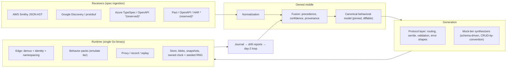

# mirror.cloud — Direction

> Critical analysis of two competing proposals, and the synthesis that becomes the project thesis.
> Status: **decided**. The executable form of this document is [`MASTER_PROMPT.md`](./MASTER_PROMPT.md).
> This document has been through an adversarial review; the attacks on it, and the positioning and delivery advice that came out of that review, are in [`CRITIQUE.md`](./CRITIQUE.md).

---

## 1. The goal, stated plainly

Developers should be able to run the cloud APIs their code depends on **locally**, with **zero friction**, for **any cloud**, at **whatever granularity they need** — one product or the whole surface — and keep it working on day 400, not just day 1.

Three properties fall out of that sentence, and every design decision below is downstream of them:

1. **Generated, not hand-written.** Hand-writing emulators is a treadmill with a vendor holding the pace clock. There is no version of "we will hand-implement every cloud" that survives contact with reality.
2. **Per-product composability.** "I need S3 and nothing else" must cost one process, one port, and sub-second boot — not a container fleet.
3. **Three honest fidelity modes.** Not everything can be emulated well. The tool must be able to say *mock*, *emulate*, or *proxy* per product, and never lie about which one you got.

---

## 2. What the market actually looks like (verified, August 2026)

These are load-bearing facts, independently confirmed rather than assumed:

- **LocalStack Community Edition is gone.** On 2026-03-23 LocalStack consolidated to a single image requiring `LOCALSTACK_AUTH_TOKEN`; the public GitHub repository was archived read-only. The last unauthenticated community release was `localstack/localstack:4.4.0`. Downstream ecosystems felt it immediately — Testcontainers (Java, Rust), Quarkus Dev Services, and Spring Cloud AWS all opened migration issues.
- **A challenger wave already exists.** Floci (MIT, `floci-io/floci`) crossed 10k stars within months, marketing itself explicitly as a drop-in LocalStack CE replacement (~90 MB image, ~24 ms start, 20+ AWS services). Ecosystem projects are actively evaluating it as the default replacement.

**The strategic reading.** The vacuum is real, but it is *already being filled* by hand-written AWS emulators. Entering that race with another hand-written AWS emulator means arriving late to a fight decided on service-count velocity — a fight where the incumbent has months of head start and the same ceiling LocalStack hit. The differentiated position is not "another emulator." It is **the thing that generates emulators**.

---

## 3. Critique: the Grok proposal

Grok proposed a Go, Smithy-driven, AWS-only emulator with eight hand-picked services and swarms A–I.

### What it gets right (keep all of this)

- **Wire-protocol compatibility is the only bar that matters.** If the official SDK, the CLI, and the Terraform provider don't work unmodified against it, nothing else counts. This is correct and non-negotiable.
- **"Hand-written protocol code is unacceptable except for thin adapters."** This is the single best line in the proposal, and Grok then fails to follow it to its conclusion (§3.2).
- **Validation oracles as the definition of done.** SDK round-trip, CLI smoke, `terraform apply`/`destroy`, multi-tenancy isolation, persistence round-trip. This is a genuinely rigorous DoD and it survives into the final design nearly unchanged.
- **Operational hygiene:** multi-account + multi-region namespacing, single static binary, distinguishable not-implemented errors, no telemetry, no phone-home, permissive license, pinned/vendored specs.

### Where it is wrong

**3.1 — AWS-only is a strategic dead end for the stated goal.** The user's requirement is "any cloud." Eight AWS services hand-built in Go, with AWS-shaped assumptions threaded through the router, store, and identity layers, produces a codebase where adding Azure or GCP is a rewrite, not an extension. The multi-cloud decision has to be made *before* the first line of the edge router, or it is never made at all.

**3.2 — It abandons codegen exactly where codegen pays.** Grok mandates Smithy-derived protocol code, then hand-picks eight services and writes them by hand — which means the generator only ever amortizes across eight consumers. The whole point of driving from an IDL is that the marginal cost of service #9 through #300 approaches zero *at the protocol layer*. Grok builds the expensive machine and then declines to use it at scale.

**3.3 — No day-2 story at all.** Cloud providers ship API changes continuously. The proposal has no mechanism for spec re-pinning, no regeneration diff, no drift detection, no answer to "AWS added a parameter and my emulator silently ignores it." Day-2 was an explicit user requirement and the proposal is silent on it.

**3.4 — Unacknowledged scope explosion, presented as achievable in one shot.** "High-fidelity DynamoDB" quietly means a full expression-language implementation (`KeyConditionExpression`, `FilterExpression`, `UpdateExpression`, `ProjectionExpression`, `ConditionExpression`) plus GSI/LSI projection semantics plus pagination cursors. "Lambda with real runtime images or a clean embedded runner" means container lifecycle management, a runtime API server, and init/invoke protocol handling. Bundling both into a one-shot alongside seven other services and a code generator guarantees that *something* silently ships as a stub — which the proposal itself forbids. Honest scoping is a feature; **Lambda is cut from v1** in the final design and replaced with a documented extension point.

**3.5 — It forbids the user's actual goal.** Non-goal: *"A general-purpose service virtualization or contract-testing platform."* But the user asked to "host real/fake/proxied cloud compatible APIs themselves" — which is service virtualization with a cloud-shaped front end. The non-goal is aimed at the wrong target.

**3.6 — No per-product granularity.** One binary on one port serving everything is LocalStack's model. The user explicitly asked for the opposite: run one product without the whole cloud.

**3.7 — Swarm decomposition has a hidden serialization.** "After the foundation contracts exist, launch C–G in parallel" means every service swarm blocks on A and B landing. In a one-shot execution that is the difference between real parallelism and a queue. The fix is to *freeze the interfaces in the prompt text itself*, so every swarm codes against an identical, already-specified contract on turn one.

---

## 4. Critique: the Kimi report

Kimi produced ~240 KB of deep research arguing for contract-driven emulation: fuse Pact + OpenAPI + AsyncAPI + HAR + Postman into a canonical behavioral model, serve it from a thin runtime, export to incumbent engines.

### What it gets right (keep all of this)

- **The fusion / canonical-model thesis.** Every incumbent picks exactly one "ingestion religion" and nobody reconciles heterogeneous artifacts. The neutral, provider-agnostic behavioral model is the defensible core, and the serving runtime is commodity. This is the correct place to put the value.
- **The amended OTel Collector topology.** Receivers → normalization → fusion → canonical model → thin runtime + optional exporters. Own the middle, delegate the edges. This is the right shape for a multi-input, multi-output mediation problem, and it has strong precedent (OTel Collector, Vector, Babel).
- **Precedence and confidence semantics.** Evidence tiers (`verified` > `observed` > `declared`), with the rule that *higher-precedence evidence narrows and lower-precedence evidence completes*, plus per-cell provenance. This is genuinely novel and directly reusable.
- **Determinism doctrine.** Emulator-owned clock and seeded RNG; generation seeded by request hash; AI belongs at generation time, never in the serving path, because tests must be reproducible. Correct and load-bearing.
- **Fail loud, never silently fall back.** A client that asked for the error case and silently got the success case will write a passing test for the wrong behavior. This becomes a hard rule.
- **Don't emulate brokers, orchestrate real ones.** Redpanda/NATS/Mosquitto are cheap now; the weight argument expired. Emulate the *counterparty*, not the protocol.
- **Governance as founding architecture.** Permissive license, published no-gating covenant, explicit scope covenant, foundation track. Kimi's central historical finding — that the documented deaths in this category (rug-pulls, paywalls, acqui-shelving) were **governance and economic failures, not technical ones** — is validated by the LocalStack CE sunset in §2 and cannot be retrofitted later.
- **Dual-lane emission.** Containers and containerless as coequal outputs, never one as the other's fallback. Docker friction (Desktop licensing, Hub pull limits, API version breakage) is real and recurring.

### Where it is wrong for *this* goal

**4.1 — "Contract-complete, not provider-complete" leaves the user with nothing to run.** The doctrine is defensible for mocking your own microservices. It is fatal here: nobody has Pact files for S3. If the ingestion surface is limited to user-authored contract artifacts, the pipeline *structurally cannot* produce a LocalStack replacement, which is the user's actual ask.

**4.2 — It underweights the vacuum its own research documents.** Chapter 1 establishes a verified, freshly-vacated, high-demand market — and Chapters 5–6 then argue for scoping out of it. The report proves the opportunity and then declines it.

**4.3 — It misses that cloud IDLs *are* contract artifacts.** This is the decisive gap. AWS publishes complete Smithy models. Azure publishes OpenAPI/TypeSpec. Google publishes protobuf and Discovery documents. These are exactly the "declared surface" evidence tier Kimi's own precedence table already defines — machine-readable, versioned, vendor-published, and covering the entire cloud API surface. Kimi built a fusion engine and then didn't plug in the largest available source of contracts in existence.

**4.4 — Over-rotation on ingestion breadth.** Pact, HAR, and Postman receivers add real surface area for a v1 that must first prove it can replace a cloud emulator. Their value is real but sequenced later; the *interface* for them must exist on day one so the claim stays true.

---

## 5. The synthesis: mirror.cloud is a compiler for cloud emulators

Grok has the right delivery vehicle and the wrong scope philosophy. Kimi has the right architecture and the wrong input set. The bridge is one observation:

> **Cloud providers already publish machine-readable contracts for their entire API surface. Treat those IDLs as first-class receivers into Kimi's canonical model, and generate the protocol layer mechanically for every service — then layer behavior only where behavior is worth paying for.**

### 5.1 The pipeline

### 5.2 Three fidelity tiers, declared per product, never implicit

| Tier | What it is | Cost | Honest use |
|---|---|---|---|
| **mock** | Generated from the spec alone. Validates input against the real shape, synthesizes a schema-valid response, deterministically seeded by request hash. Naive CRUD where operation naming permits (`Create*`/`Get*`/`List*`/`Delete*`). | ~zero marginal cost per service | Wiring, plumbing, SDK-integration and error-path tests across the entire long tail of cloud services |
| **emulate** | A hand-written behavior pack implementing real semantics on top of the generated protocol layer. | expensive, deliberate, few | The services people actually build on |
| **proxy** | Pass-through to the real cloud, with record → replay cassettes and drift reporting. Off by default; secrets scrubbed. | cheap, requires credentials | Fidelity escape hatch, and the oracle that keeps the other two tiers honest |

Every response carries `x-mirror-fidelity: mock|emulate|proxy`. A `--strict` mode refuses to serve mock-tier at all. **This is the differentiation:** Floci and LocalStack give you a curated list and a wall. mirror.cloud gives you a curated list, and behind it the entire published API surface at declared-lower fidelity, and behind that the real thing.

### 5.3 Per-product granularity

`mirror up s3` boots one product. `mirror up s3,sqs` boots two. `mirror up --profile aws-core` boots a set. Per-service Docker images are generated from the same model. A Go in-process lane exists for tests that shouldn't pay for a socket. Nobody is required to boot a cloud to test one bucket.

### 5.4 Day-2 is a first-class feature, not an afterthought

This is where the project earns its keep after the novelty wears off:

- `mirror spec update` re-pins the vendored provider specs, regenerates, and emits a **semantic API-surface diff** (operations added/removed, shapes changed) as a reviewable artifact. Provider API drift becomes a pull request, not an outage.
- **Regeneration is asserted byte-identical in CI** — generated code is committed, and a test proves it reproduces from the pinned specs.
- `mirror drift` replays cassettes against the emulator and reports divergence between emulated and real behavior.
- `mirror doctor` diagnoses the actual day-2 pain: wrong env vars, port conflicts, region mismatch, path-style vs virtual-host, credentials leaking to real endpoints.
- `mirror snapshot save/load` gives away the state-portability feature that incumbents charge for.
- `mirror support-matrix` generates the supported-service table from the model, so documentation cannot rot.
- A structured journal, queryable at `/_mirror/journal`, answers "why did my SDK call fail" without a debugger.

### 5.5 Governance, decided now because it cannot be decided later

Apache-2.0. No auth token, ever, for any capability. No telemetry, no phone-home, no license check. A published scope covenant ("spec-complete by generation; behavior-complete only where declared") and a published gating covenant, both committed to the repository before any commercial entity exists. Kimi's historical evidence on this is the strongest part of the report, and the LocalStack sunset in §2 is the freshest possible proof.

---

## 6. Scope decisions for v1

| Decision | Value | Rationale |
|---|---|---|
| Language | **Go** | Single static binary, fast cold start, strongest precedent in this tool class, best agent reliability on large codebases |
| Emulate-tier services | **S3, DynamoDB, SQS, SNS, STS, IAM(-lite), SSM, Secrets Manager** | The verified core of what the vacated market actually used |
| Cross-cloud proof | **Google Cloud Storage**, generated through the same pipeline | Forces the canonical model to be provider-neutral in practice, not just in claim. Without a second provider, the abstraction is unfalsifiable |
| Mock tier | **A curated set (~20–30 commonly co-used services), extensible with `mirror spec add`** | The differentiation, without a heavy default binary. Generating every published service would blow both the cold-start and binary-size budgets that make the tool pleasant |
| Lambda | **Cut from v1**, extension point specified | Honest scoping. Compute lifecycle is a project unto itself; shipping it as a stub violates the no-stubs rule |
| IAM policy evaluation | **Not implemented**, `Authorizer` interface is the seam | Documented allow-all beats a wrong policy engine |
| User-artifact fusion (Pact/OpenAPI/HAR) | **Reserved architecturally**, not implemented | The receiver interface and precedence model are built for it so the claim stays true; implementing it in v1 splits focus off the wedge |
| Async brokers | **Orchestrate real ones**, never emulate the protocol | Kimi's tier doctrine; the weight argument expired |

---

## 7. Positioning

The architecture above is an architect's argument. It is not the pitch. A developer decides in five minutes, and the claim that survives contact with them is:

> **Run cloud APIs locally. The ones you depend on, emulated. The ones you touch incidentally, mocked. The ones you must be exact about, proxied to the real thing and recorded. No account, no token, ever.**

Two disciplines follow, and both are non-negotiable because violating either turns the project's honesty into marketing:

- **Never advertise a raw service count.** `docs/SUPPORT.md` is generated from the model and reports emulate-tier and mock-tier separately. A count that conflates them recreates exactly the expectation gap that makes emulators disappointing.
- **The felt pain, stated in one line, is: *one unsupported API call should not kill your test suite.*** That is what mock tier actually buys, it is true, and it is enough.

The full positioning, iteration, and delivery argument — including why this project should be *compatible with* rather than positioned against the current challenger, and why the governance covenants must be published before the code — is in [`CRITIQUE.md`](./CRITIQUE.md), Part 3.

## 8. What "done" means

The definition of done is behavioral, automated, and hostile to self-congratulation: official SDKs (Go, Python, and the Google storage client) round-trip; AWS CLI v2 works against it unmodified; `terraform apply` and `terraform destroy` both succeed across all emulate-tier services; two accounts cannot see each other's resources; snapshot/restore round-trips; identical seeds produce byte-identical responses; a single product boots standalone; cold start is under two seconds; regeneration from pinned specs produces a zero diff; and unimplemented operations return an error that is unmistakably ours and never mistakable for the real cloud's.

The full, self-contained execution specification — frozen interfaces, protocol details, per-service operation lists, swarm contracts, and every validation oracle — is in [`MASTER_PROMPT.md`](./MASTER_PROMPT.md).
